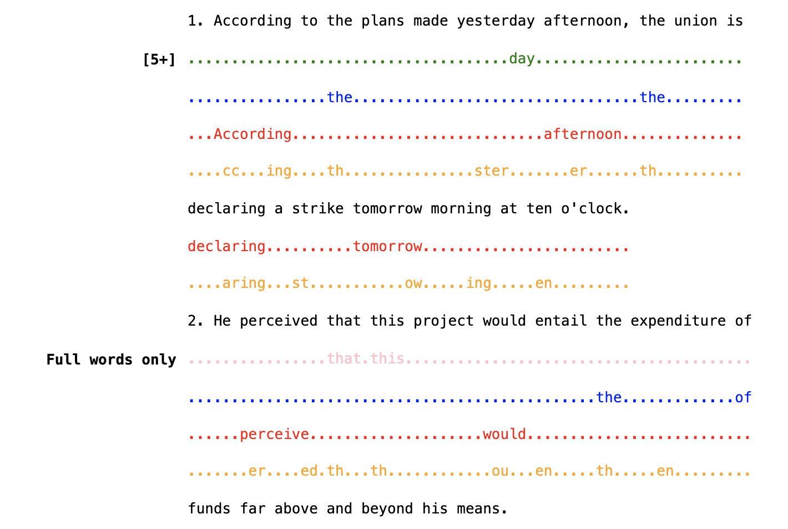

# Annotated Text to HTML Converter

A Python program that processes a configuration file and an input text file to generate an HTML file with annotated lines. It highlights matched words and categorizes them with line-type identifiers using CSS Grid for alignment.

## Features

- **Highlight Words:** Customize colors and styles for matched words.
- **Categorize Annotations:** Use line-type identifiers to classify different annotations.
- **Flexible Matching:** Supports full word, substring, and not beginning match types.
- **Clean Layout:** Utilizes CSS Grid for consistent and aligned HTML output.

## Configuration

Define your annotation rules in `config.py`. Each rule is a dictionary with the following keys:

- `line_identifier`: A string to identify the type of annotation.
- `match_type`: Type of matching (`full_word`, `substring`, `not_beginning`).
- `color`: Color to highlight the matched words.
- `strings`: List of words or substrings to match.
- `style` (optional): Text style (`bold`, `italics`, `strikethrough`).

**Example:**

```python
array_of_lists = [
    {
        "line_identifier": "[45+]",
        "match_type": "substring",
        "color": "green",
        "strings": ["upon", "word", "those", "whose", "these"],
    },
    {
        "line_identifier": "Full Words",
        "match_type": "full_word",
        "color": "red",
        "style": "strikethrough",
        "strings": ["abouts", "almosts", "hims", "hims"],
    },
    # Add more configurations as needed
]
```

## Usage

1. **Prepare the Configuration:**

   Edit `config.py` to define your annotation rules as shown above.

2. **Prepare the Input File:**

   Place your input text in `sample.txt`.

3. **Run the Script:**

   Execute the Python script:

   ```bash
   python annotate.py
   ```

   This will generate `output.html` with the annotated content.

## Output

The program generates an `output.html` file with annotated lines. Each annotation is categorized by its line-type identifier.



## Dependencies

- **Python 3.6+**

No external libraries are required beyond the Python standard library.

## License

This project is licensed under the MIT License.
